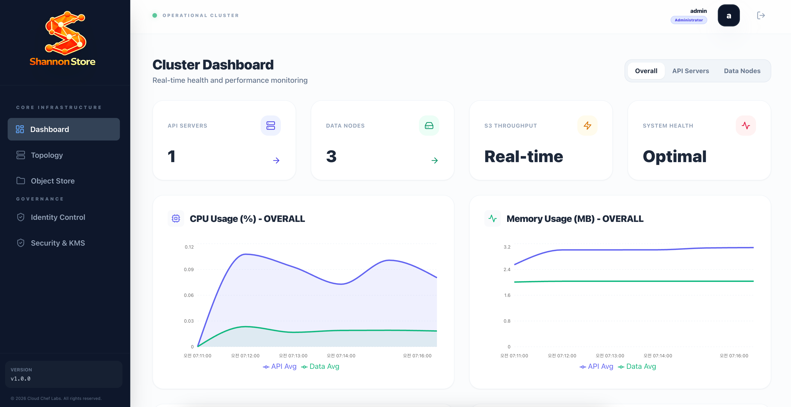

# Getting Started

This shows how to install ItdaStream on local to experience it quickly.

## Prerequisites

Because ItdaStream is written in Java, Java 17 needs to be installed on local.

## Install ItdaStream on Local

ItdaStream distribution can be downloaded like this.

```agsl
curl -L -O https://github.com/cloudcheflabs/itdastream-pack/releases/download/itdastream-archive/itdastream-1.0.0.tar.gz
```

And untar the downloaded package.
```agsl
tar zxvf itdastream-1.0.0.tar.gz

cd itdastream-1.0.0;
```


Run Zookeeper.

```agsl
bin/start-zk.sh
```

ItdaStream needs a S3 bucket where all the logs will be saved.
After a bucket and the S3 credentials are created, run the broker server with replacing the following environment variables with yours.
```agsl
# master key.
export ITDASTREAM_MASTER_KEY="MustBeChanged01234567890123456789012345678901"

# s3 connection info.
export ITDASTREAM_STORAGE_S3_ENDPOINT_URL=endpoint
export ITDASTREAM_STORAGE_S3_BUCKET_NAME=bucket
export ITDASTREAM_STORAGE_S3_REGION_ID=any-region
export ITDASTREAM_STORAGE_S3_ACCESS_KEY_ID=access-key
export ITDASTREAM_STORAGE_S3_SECRET_ACCESS_KEY=secret-key

# start broker.
bin/start-broker.sh
```

> Environment variable `ITDASTREAM_MASTER_KEY` that must be at least 32 characters needs to be exported when running ItdaStream broker servers.


Visit admin page of ItdaStream.

```agsl
http://localhost:8080/admin
```

First initial admin user and password is `admin` / `admin`, after that you need to change the initial password.




## Run Console Producer and Consumer
In order to experience to send and receive messages to/from ItdaStream, 

first run console consumer.
```agsl
bin/kafka-console-consumer.sh --brokers localhost:9092 --topic my-topic
```

In another terminal, run the console producer, and type some messages to send. 
```agsl
bin/kafka-console-producer.sh --brokers localhost:9092 --topic my-topic
```

And then, you will see the messages received in the console consumer.


## Stop Servers

Stop zookeeper and broker.

```agsl
bin/stop-broker.sh 
bin/stop-zk.sh
```

